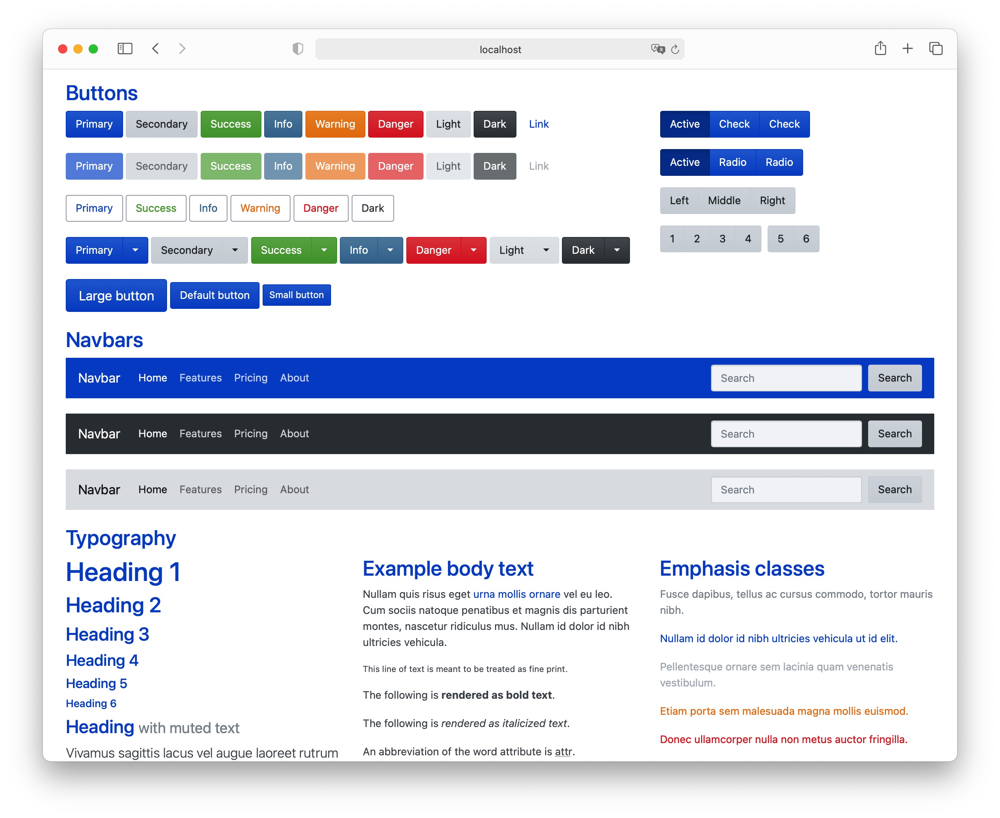

# Cayenne Bootstrap Theme


An elegant theme for Bootstrap 4, powered by [HackerThemes](https://hackerthemes.com). Name is inspired by Porsche Cayenne.

## Looking



## Installation

By NPM:

```bash
npm install @cayenne-ui/css --save
```

or by Unpkg CDN:

```html
<!-- normal css -->
<link rel="stylesheet" href="https://unpkg.com/@cayenne-ui/css@latest/dist/css/cayenne.css" />

<!-- minimized css -->
<link rel="stylesheet" href="https://unpkg.com/@cayenne-ui/css@latest/dist/css/cayenne.min.css" />
```

## Prerequisites

- This works on Windows, macOS and Linux.
- Node Package Manager and Gulp are required. Make sure you can run `gulp -v` and `npm -v`.
- You can get Node at [nodejs.org](https://nodejs.org), then install gulp using `npm install gulp-cli -g`

## Preview the Theme

1. Clone this repo
2. Run `npm install`
3. Run `gulp watch` or `npm run build:watch`
4. Start a local HTTP server under the root directory of the project, [`hs`](https://www.npmjs.com/package/hs) is recommended.

## Edit the Theme

1. Add any Bootstrap Sass variables into `scss/_variables.scss`
2. Add any custom styles into `scss/_styles.scss`. You can use Bootstrap's mixins here.

## Build the Theme

1. Run `npm run build`
2. CSS will be exported at `css`

## Creators

**Lenconda**

- <https://lenconda.top>
- <https://github.com/lenconda>

**Bootstrap**

- <https://github.com/twbs/bootstrap/>

## Copyright and license

Code and documentation copyright 2021 [Lenconda](https://lenconda.top).

Code released under the [MIT License](https://opensource.org/licenses/MIT).
